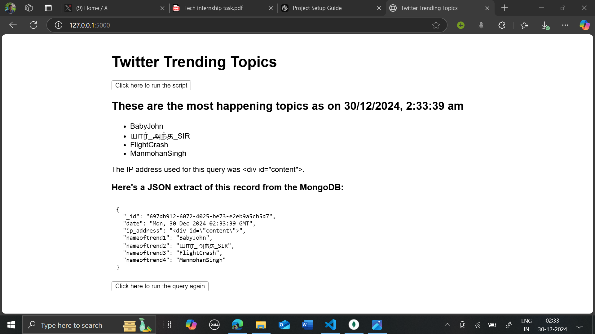

# Twitter Trends Scraper

## Description
This project is a web application that scrapes Twitter's trending topics using Selenium and Flask. It uses proxies to avoid getting blocked by Twitter and stores the fetched trends in a MongoDB database. Users can interact with the application via a web interface to view the latest trending topics and retrieve them as JSON records stored in MongoDB.

## Features
- **Twitter Trends Scraper**: Fetches trending topics from Twitter.
- **Proxy Support**: Uses a proxy manager to rotate proxies for scraping.
- **MongoDB Storage**: Saves scraped data (trends and associated information) in a MongoDB database.
- **Flask Web Interface**: A simple interface to display the trends and their corresponding metadata.
- **Retry Mechanism**: In case of failure, the app retries fetching trends.
  
## Pre-requisites
Before you begin, ensure that you have met the following requirements:

- Python 3.x
- Google Chrome installed
- ChromeDriver matching your Chrome version
- MongoDB running locally or remotely
- Proxy service (for avoiding IP bans from Twitter)

### Additional Requirements
- Selenium
- Flask
- Requests
- PyMongo
- pytest (for testing)

These can be installed using the `requirements.txt` file provided.

## Detailed Installation Instructions

1. **Clone the Repository**: 
   First, clone the repository to your local machine.
   ```bash
   git clone https://github.com/yourusername/twitter-trends-scraper.git
   cd twitter-trends-scraper

2. **Set up a Virtual Environment**:
   To avoid conflicts with other Python projects, it's best to create a virtual environment.
   ```bash
   python -m venv venv

3. **Activate the Virtual Environment**:
   Once the virtual environment is created, you need to activate it.
   - On **Windows**:
     ```bash
     venv\Scripts\activate
     ```
   - On **macOS/Linux**:
     ```bash
     source venv/bin/activate
     ```
   You will know the virtual environment is active when you see `(venv)` before the command prompt.

4. **Install Required Packages**:
   The required packages for the project are listed in the `requirements.txt` file. Install them by running:
   ```bash
   pip install -r requirements.txt

5. **Configure MongoDB**:
   - Install MongoDB if you haven't already
   - Create a new database named `twitter_trends`
   - Copy the `.env.example` file to `.env` and update with your MongoDB connection string:
   ```bash
   cp .env.example .env
   ```
   Then edit the `.env` file with your MongoDB details:
   ```
   MONGODB_URI=mongodb://localhost:27017/twitter_trends
   ```

## Running the Application

1. **Activate the Virtual Environment**:
   - On **Windows**:
   ```bash
   venv\Scripts\activate
   ```
   - On **macOS/Linux**:
   ```bash
   source venv/bin/activate
   ```
   You should see `(venv)` appear at the beginning of your command prompt.

2. **Start the Flask Server**:
   ```bash
   python app.py
   ```
   The server will start on `http://localhost:5000` by default.

3. **Access the Web Interface**:
   - Open your browser and navigate to `http://localhost:5000`
   - The homepage will display the latest trends
   - Use `/api/trends` endpoint to get JSON data


## Example Output



*Example of the Twitter Trends Dashboard showing trending topics and their metadata*

## Author
- **Ansh Zala**
- **Email** - *anshzala20@gmail.com*
- **LinkedIn** - *[ansh-zala](https://www.linkedin.com/in/anshzala/)*
